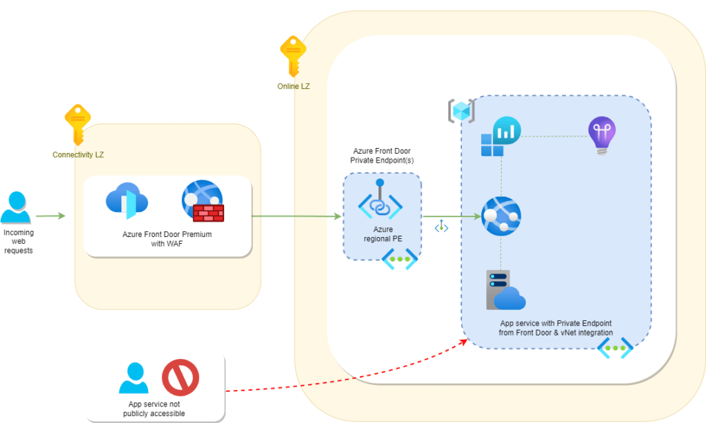

#  Azure Front Door + App Service with Private Link & WAF (Terraform)

This project provisions a **secure, production-ready Azure Front Door Premium** instance with **Web Application Firewall (WAF)** protection, **private endpoint integration** for App Services, and **Private DNS** for secure name resolution — all automated with **Terraform**.

---

##  Features
- **Azure Front Door Premium** with global edge routing
- **Web Application Firewall (WAF)** with OWASP + Bot Manager rules
- **Private Link** integration to App Services (no public exposure)
- **Private DNS Zone** linked to VNets for origin resolution
- **Automatic approval** of private endpoint connections
- Modular Terraform design supporting multi-environment deployments (`sbox`, `dev`, `test`, `prod`)

---

##  Architecture

 
---

##  How It Works
1. **External users** hit the Azure Front Door endpoint.  
2. Requests are evaluated by **WAF rules** (SQLi, XSS, Bot protection, etc.).  
3. Front Door forwards **approved traffic** to App Services via **Private Endpoint**.  
4. **Private DNS Zone** resolves the App Service’s private FQDN, ensuring no public IP path is used.  
5. **Terraform** modules manage the entire lifecycle, enabling reproducible deployments across environments.  
